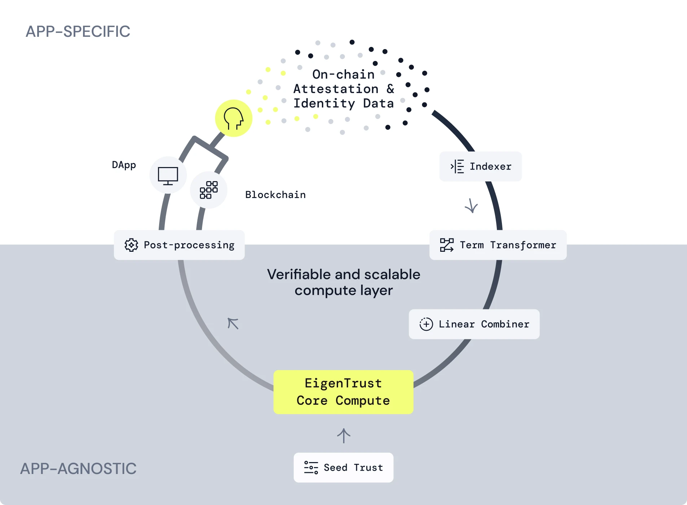

# rs-eigentrust - Trust Computer for Snaps

We perform [EigenTrust](https://nlp.stanford.edu/pubs/eigentrust.pdf) algorithm
on peer-to-peer trust signals.
These signals include both trust and distrust credentials, conforming to this
**[draft CAIP](https://github.com/dayksx/CAIPs/blob/main/CAIPs/caip-x.md).**
The results of the compute provide reputation score for users in two contexts -
Software Security and Software Development. These User reputation scores are
used to calculate Snap scores and Community Sentiment, which helps surface Snaps
considered Safe or Malicious based on community reputation.

### **Inputs**

Users can issue explicit trust or distrust attestations to each other and Snaps.
The following attestations are used for this prototype:

***User to User attestations***

- I assert that I trust ('Endorse') an account/user's software security
  (auditor) abilities
- I assert that I distrust ('Report') an account/user's software security
  (auditor) abilities
- I assert that I trust ('Endorse') an account/user's software development
  (developer) abilities
- I assert that I distrust ('Report') an account/user's software development
  (developer) abilities

***User to Snap attestations***

- I dispute a snap version
- I endorse a snap version

### **System Architecture**

The system performs a few tasks in sequence:

- Take the input data (attestations) from the data layer (Indexer)
- Transform the data for pre-processing (Attestations Transformer and Linear
  Combiner)
- Perform core compute and avail the compute result (Trust Computer)
- Perform post-processing on computed results (Snaps Score Logic)

### How does the Algorithm work?

**Phase 1: Determine Trustworthiness of Users**

We model a graph (network) of users and snaps, then run the EigenTrust algorithm
to compute trustworthiness of each user based on the attestations ('Trust
Credentials') received from others.

**1a: EigenTrust scores for Users**

This phase takes the trust graph expressed between users as the input, then
outputs trust scores to each of them. Only positive P2P trust is considered;
negative trust is applied in phase 1b.

**1b: Distrust Adjustment for Users**

In general, distrust signals cannot be recursively interpreted, so we do not use
the distrust signals as part of local trust in Phase 1a. Instead, once Phase 1a
is finished and we have trust score for all users, we apply a one-shot discount
of trust score, with using distrust opinions by auditors. The distrust opinions
held by the same user are normalized to their trust score, that is, a user is
allowed to discredit/discount other users as much as his own trust standing,
e.g. if a user X distrusts 7 other users, each of the 7 users’ trust score will
receive a deduction equal to 1/7 of X’s trust score. Distrust opinions of only
those who have a positive standing count; if someone received zero score in
Phase 1a, their distrust opinions won’t matter.

**Output:** Two scores for each EOA, security trust score (auditor) and dev
trust score (developer). It's a number between -1.0 and +1.0.

**Phase 2: Determine Community Sentiment of Snaps**

Once Phase 1 is finished, each user gets assigned a trust score, which is used
to weight the review of that user about a Snap.

The Snaps’s **security score** is calculated as a weighted average of the
individual attestations from peers about the Snap being secure or insecure.
Given an individual rating $R(s, p)$ (0 or 1) for a Snap $s$ by a peer $p$ and
the trust score of the peer $T(p)$, the Snap’s overall security rating is given
as:

$$
R_c(s) = {{\sum R(s,p)T(p)} \over {\sum T(p)}}
$$

A Snap also gets a **snap confidence score**. $C(s)=\sum T(p)$ is defined as the
cumulative trust **confidence level** of the resulting score. It helps factor in
the reputation of users who have endorsed or reported a Snap, and is useful in
fending of a class of sybil attacks.

**Output:** Each snap will get only one score (security), which consists of two
numbers: Snap security score (0.0-1.0) and Score confidence (0.0-1.0).

### The Scoring Thresholds for Community Sentiment

This is a post-processing step. It basically enables any developer to utilize
the user reputation scores to create their own Safety thresholds for Snaps.
These thresholds can then power ranking, recommendation on any Snap Directory or
Marketplace.

For this prototype, we have used conservative thresholds for calculating
Community Sentiment for User and Snap reputation. The detailed explanation of
the Community Sentiment logic is below. **Anyone can run the compute steps
described above on their local machine and generate these scores to verify that
the compute was done correctly.**

$P$ denotes the set of all peers (security experts) in the network. For a peer
$p$, $T(p) \in [-1..1]$ denotes the trust standing (distrust-adjusted EigenTrust
score) of the peer (in the “security” scope), and $T^+(p) \in [0..1]$ denotes
the positive-local-trust-only trust standing (pure EigenTrust score without
distrust adjustment) of the peer.

We appoint some peers (auditors) so that their opinion immediately matters
(precise definition is given below). We call them *highly trusted auditors.*
[Note – Under the current trust graph model, we define highly trusted auditors
as peers directly endorsed by the pre-trusted peers. – end note]
$P_h \subset P$ denotes the set of all highly trusted auditors in the network.

Given a Snap $s$, $O(s) \subset P$ is the set of peers who opined (filed a
StatusCredential) on $s$. For $p \in O(s)$ $p \in O(s)$$R(s,p) \in [0..1]$
denotes the peer $p$’s status opinion about the Snap $s$.

We define the security score for the Snap $s$ as a set of two numbers:

- **Score value** $R_c(s) \in [0..1]$
- **Score confidence level** $C(s) \in [0..1]$

The score value is the weighed average of opinions, weighted by the opiner’s
trust standing; the score value is the sum of all opiners’ trust standings:

$$
\begin{align*}C(s) &= \sum_{p \in O(s)} T(p)\\
R_c(s) &= {{\sum_p R(s,p)T(p)} \over {\sum_p T(p)}} \\ &= {{\sum_p R(s,p)T(p)}
\over C(s)} \end{align*}
$$

Until a Snap $s$ gathers strong enough of collective opinions, as measured by
the opiners’ trust standings $C(s)$, we do not display the community sentiment.
A Snap in this state is called **Insufficient Reviews.**  The collective opinion
$R_c(s)$ does not matter in this case, e.g. it may solely consist of malicious
sybils’ opinions.

Once $s$’s collective opinion becomes strong enough, i.e. $C(s)$ reaches a
threshold, we take a look at the actual collective opinion $R_c(s)$. The
threshold is set in such a way that any highly trusted auditor opining is
sufficient, i.e. $C(s) \ge T^+(d)$, where $d$ is the weakest highly trusted
auditor (weakest = with lowest positive-LT-only trust score).

[Note – We use positive-LT-only trust score as the threshold criteria
to keep the bar high. If we used negative-adjusted trust score,
the bar could be brought arbitrarily low if a highly trusted auditor became
targeted by other highly trusted peers with distrust credentials. – end note]

We consider $R_c(s)$ by comparing it against two thresholds $R_E$ and $R_R$ (
$0 < R_R < R_E < 1$):

- Iff $R_c(s) > R_E$, we label $s$ with the **Endorsed by Community** badge (
  “Endorsed” hereafter).
- Iff $R_c(s) < R_R$, we label $s$ with the **Reported by Community** badge (
  “Reported” hereafter).
- Otherwise, i.e. $R_R \le R_c(s) \le R_E$, we label $s$ with the **In Review**
  badge.

We define $R_E$ and $R_R$ **conservatively**, such that a Snap cannot be in the
Endorsed or Reported state – and instead fall into the In Review state – if at
least one highly trusted auditor disagrees with that disposition:

- As long as at least one highly trusted auditor reports a Snap as insecure, the
  Snap cannot be in the Endorsed state.
- As long as at least one highly trusted auditor endorses a Snap as secure, the
  Snap cannot be in the Reported state.

In other words, in order for a Snap to be labeled with the Endorsed or Reported
badge, the highly trusted auditors who opined on the Snap must all agree on the
disposition – they must be *unanimous*.

For the conditions above, we consider the worst case, where everyone with
positive trust standing – not just highly trusted auditors – has voiced opinion
about $s$, that is, $C(s)$ cannot be any higher, and only one highly trusted
auditor $d \in P_h$ (for “dissident”) disagrees with everyone else about $s$,
where $d$’s positive-LT-only trust standing is the lowest among all highly
trusted auditors (that is, $d$ is the “weakest dissident”).

- If $d$ is the only one that reported the Snap whereas everyone else endorsed
  it:

  $$
  R(s,p) = \begin{cases} 1\text{ if }p \ne d \\ 0\text{ if }p = d \end{cases}
  $$

  This results in the highest Snap score value threshold where the Snap is still
  “In Review” state, due to the sole dissident. That is:

  $$
  R_E = {C(s)-T^+(d) \over {C(s)}}=1-{T^+(d) \over C(s)}
  $$

- Similarly, if $d$ is the only one that endorsed the Snap whereas everyone else
  reported it:

  $$
  R_R = {T^+(d) \over {C(s)}}
  $$

All in all, the Snap $s$ earns:

- $C(s) < T^+(d)$ ⇒ **Insufficient Reviews**
- $C(s) \ge T^+(d)$:
    - $R_c(s) > 1-{T^+(d) \over C(s)}$ ⇒ **Endorsed**
    - $R_c(s) < {{T^+(d)} \over C(s)}$ ⇒ **Reported**
    - ${{T^+(d)} \over C(s)} \le R_c(s) \le {1-{T^+(d) \over C(s)}}$ ⇒ **In
      Review**

### **Community Sentiment Status/Badges**

**Snaps Community Sentiment Badges:**

- **[Insufficient Reviews]:** A Snap which doesn't have enough reviews from
  highly reputable users ('highly trusted' threshold defined above).
- **[Endorsed]:** A Snap which has received endorsements (and no reports) from
  highly reputable Users.
- **[In Review]:** A Snap which has received at least 1 report from a highly
  reputable auditor *and* at least 1 endorsement from a highly reputable auditor
  will be in the status until resolved.
- **[Reported]:** A Snap which is Reported by reputable auditors

**User community sentiment badges:**

- **[Highly Trusted]:** A User who has received endorsements from other highly
  trusted users
- **[Reported]:** A User who has been Reported by a highly trusted User
